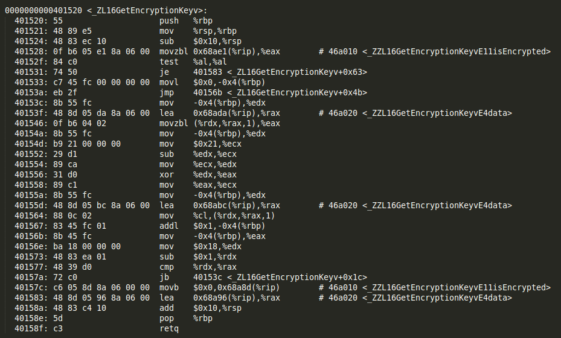
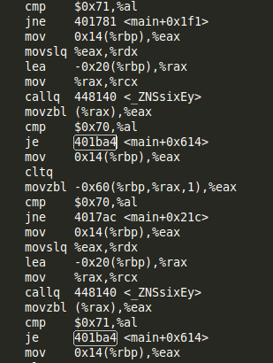

# Your ID, Your passwd
**Points:** 100
**Category:** Reverse
**Author:** [chinmay_dd](https://github.com/chinmaydd)

> You have lost all memory of the love of your life.The only thing you know is that logging in this mysterious black-box will help you remember everything. Can you do it?
>
> [`your_id.tar.gz`](your_id.tar.gz)
>
> Hint: None

## Write up

We were given a windows executable(.exe) file. On opening it, we are prompted for an email-id and a password. On first attempts, it is tough to identify if there exists a single password for all email-id's or if it is dynamic in nature. For a wrong combination of email-id and password, it prints "Try again" to the screen and then exits the program. 

`strings` proves to be ineffective against it. 

Now, we can disassemble to program using objdump. See that there are 3 functions in total - 'sleep','GetEncryptionKey' and 'main'.

```
objdump -d reverse.exe > output.txt
```

If we analyse the GetEncryptionKey function , we find that it is a simple XOR cipher. We can also conclude that each element of the array(string) is XOR'ed with 
(0x21-i) where i is a counter which goes from 0-length of flag. But since we do not know the elements of the array, we cannot reverse engineer the flag from this data.



We should now turn our attention to the main function.

Closely observe in the main function that we have `je 401ba4` repeating itself(~26 times). 

Look at the first such instance of the comparison - 



Here it is checking if the ith index in string1 has data $0x70 and string2 has the data $0x71. And the next one checks if string1 has data 0x71 and string2 has data 
0x70. If we translate this to ASCII we get that the elements should be 'p' OR 'q', i.e if string1 has 'p' , string2 should have 'q' and vice-versa. 

Let us consider the case if the following condition turns out to be true, i.e let us go to the location 'je 401ba4'. Here we see that a counter is incremented everytime the check turns out to be correct. This indicates that there are multiple 'if' statements in the program. 

Now, let us see what happens if the condition is false. It goes to another check(suggesting that there is an OR statement) where we have 'w' and 'o' as the characters under consideration. 

If we continue, it is found that there is a 1-1 mapping between the characters of the "QWERTY" keyboard. 'w' is mapped to 'o', 'e' is mapped to 'i' and so on. The nth alphabet from the right on any row is mapped with the nth alphabet on the left of the same row. 

The incrementing of the counter also suggests that the email-id and the password length have a relation. On brute-forcing a bit, we find that the username, i.e the string before the '@' character in the email-id is what is compared with the password length.

On entering the correct combination of username and password, we get the flag - 

> flag{i_love_ice_creams}

## External Write ups